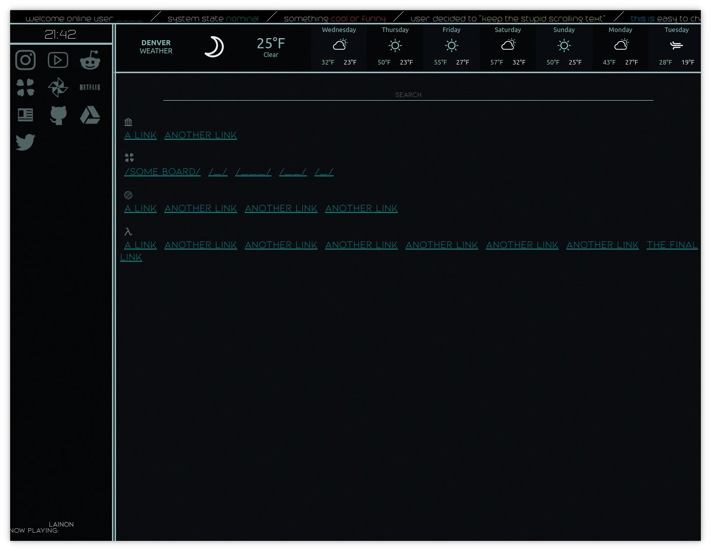

# Custom webpage for new tabs.
### I use this with my Vivaldi but it should work with any web browser.
&nbsp;
&nbsp;
&nbsp;
### Why is this here?
I mainly used this in order to learn how to use cli git, and to share a simple webpage for anyone to use.
&nbsp;
&nbsp;
### Preview

&nbsp;
&nbsp;
### Changing the weather widget
The weather widget at the top was generated here: https://weatherwidget.io
